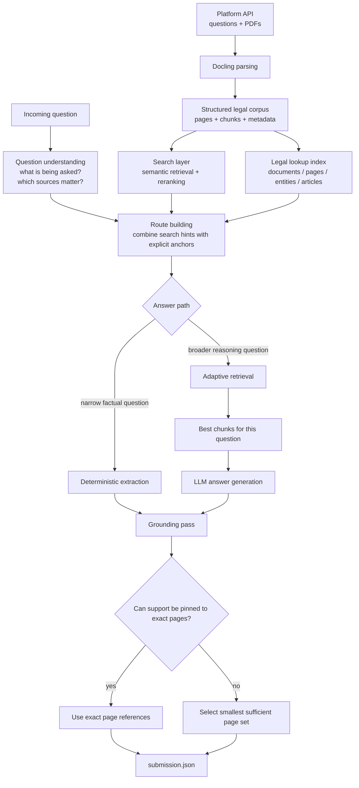

## Final Approach

This was not a simple "search the chunks and ask one model" pipeline. The final solution was built as a staged legal-question answering system with separate steps for document preparation, question understanding, answer generation, and evidence grounding.

The most important design decision was to separate answering from proof. The system first tried to produce the best possible answer, and then it ran a separate grounding step whose only job was to attach the smallest set of supporting pages needed for the final submission.

## Metrics

Final [leaderboard](https://agentic-challenge.ai/leaderboard) metrics:

| Place | Team | Final Score | SLM Metrics | LLM Judge Score | Average TTFT | TTFT Bonus |
| ---: | --- | ---: | ---: | ---: | ---: | ---: |
| 21 | oNLP fans | 0.898311 | 0.985714 | 0.76 | 321 | 1.0434 |

Observed submission history during the competition:

| Date / Time | Ver | Phase | Det | Asst | G | T | F | Total Score | Status |
| --- | --- | --- | ---: | ---: | ---: | ---: | ---: | ---: | --- |
| March 22, 2026 08:55 PM | `v2` | `final` | 0.798 | 0.557 | 0.609 | 1.000 | 1.004 | 0.443 | Completed |
| March 19, 2026 09:34 PM | `v14` | `warmup` | 0.986 | 0.753 | 0.926 | 0.996 | 1.042 | 0.881 | Completed |

The competition leaderboard and the live submission table were produced by different evaluation views, so those numbers should be treated as complementary rather than directly comparable.

### Data Roadmap

The end-to-end data flow in the final solution is:

1. Download competition questions and PDFs from the platform API.
2. Parse PDFs into structured page-level data instead of treating them as raw text blobs.
3. Build several search views over the same corpus: semantic search, reranking, and a lightweight legal lookup index.
4. Read each question and determine what kind of problem it is: single-document lookup, comparison, article lookup, absence check, metadata extraction, or open free-text reasoning.
5. Narrow the candidate document set using explicit anchors from the question such as case numbers, law numbers, titles, article references, party names, and document structure hints.
6. Choose the most appropriate retrieval behavior for that question rather than using one fixed retrieval recipe for everything.
7. If the question is narrow and factual, answer it with a deterministic extraction path.
8. Otherwise, retrieve the best chunks, generate the answer with the LLM, and optionally refine free-text output.
9. After the answer is ready, run a separate evidence pass to choose the minimal set of supporting pages.
10. Write the final submission in the platform format with answer telemetry and page references.

### Architecture Diagram

### Corpus Layer

The first step was turning PDFs into a representation that preserved document structure. That matters a lot for legal material because the useful answer often lives in very specific regions:

- title pages
- first pages of judgments
- order sections
- conclusion sections
- article-specific clauses
- party and judge blocks

Instead of relying on one index, the system kept multiple ways to access the corpus:

- semantic retrieval for broad recall
- reranking for precision
- a legal lookup index for titles, case numbers, law numbers, article references, parties, judges, and page roles

That multi-view setup made it possible to recover from two common failure modes:

- the search was too broad and returned many vaguely related chunks
- the search was too narrow and missed the exact law, article, or case the question was pointing to

### Question Understanding Layer

Before retrieval, the system tried to understand what the question actually required.

This step answered questions like:

- Is this a direct metadata lookup or an open free-text question?
- Is the answer likely to come from one document or several?
- Is the user asking about a case, a law, a specific article, an order, a deadline, a party, or a judge?
- Does the question mention exact anchors such as case IDs or law numbers?
- Which part of the source is most likely to contain the answer?

This mattered because legal questions are highly uneven. A question like "who is the claimant?" should not go through the same path as a question that compares two cases, checks whether something is absent from the record, or asks for the meaning of a clause.

### Route Building And Retrieval

Retrieval was adaptive.

The system did not use one fixed search strategy for every question. Instead, it first built a candidate route from:

- the user question itself
- rewritten search-oriented variants of the question
- explicit anchors extracted from the question
- title matches and legal identifiers recovered from the corpus

Then it chose retrieval behavior based on the question type.

In plain language, the retrieval policy was:

- use broad semantic search when the question is open and the source is not obvious
- use more focused evidence-first retrieval when the question points to a narrow clause or article
- use multi-source retrieval when the answer needs support from several documents
- use anchor-protected retrieval when the question names a very specific case or law and the generic search is drifting too far away

This adaptive routing was one of the main differences between the final system and a baseline RAG pipeline.

From the final debug snapshot:

- 900 questions were answered
- 402 questions were handled by the deterministic extraction branch
- many of the remaining questions went through the adaptive multi-source retrieval path rather than a single fixed retriever

### Answering Layer

The answering stage has two main branches.

For deterministic or narrow factual tasks, the system tried to answer directly from localized evidence. This branch was used for things like:

- party names on first pages
- law metadata on title pages
- consultation contacts and deadlines
- issue dates, claim numbers, claim amounts
- some comparison questions that can be reduced to structured extraction

If that path could not safely finish the task, the system fell back to generative answering:

- `gpt-4.1-mini` is the default answer model
- `gpt-4.1` is used as a stronger override for free-text answers
- free-text answers can go through a refinement step
- absence-sensitive outputs can be rewritten through a contextual abstention path when evidence is weak

### Grounding Layer

The final leaderboard rewarded grounded answers, so the grounding stage is a first-class component.

After the answer text or scalar value is produced, the system tries to recover support pages in this order:

1. exact page references from deterministic evidence matching
2. page refs recovered from answer citations
3. heuristic candidate pages from retrieved chunks
4. a separate LLM-based selector that chooses the minimal supporting page set

The selector is explicitly instructed not to answer the question again. Its job is only to choose the smallest page set that still supports the final answer, especially for multi-source comparisons.

In the final debug snapshot, grounding was mostly done through exact page references:

- exact page grounding: 677 questions
- grounded abstentions for "not found" type answers: 130 questions
- citation-derived page grounding: 76 questions
